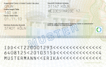
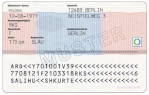

# Identity Card and Passport classification API
Identify and classify IDs and passports on documents.

#### Endpoints
The Identity Card and Passport classification API is available on [RapidAPI](https://rapidapi.com/tssd/api/identity-card-and-passport-classification/).

URL (authentication required):  
https://identity-card-and-passport-classification.p.rapidapi.com/api/v1/identification

#### Supported ID Cards:
| COUNTRY 	| TYPE     	| FRONT 	            | EXAMPLE 	                                                            | BACK                 	| EXAMPLE                                                        	    |
|---------	|----------	|:-----:	            |----------	                                                            |------	                |----------	                                                            |
| Austria	| IDCARD 	| :heavy_check_mark:   	|    	    | :x:                  	|                                                               	    |
| Chile 	| IDCARD 	| :heavy_check_mark:   	|    	        | :x:                  	|                                                               	    |
| Czech 	| IDCARD 	| :heavy_check_mark:   	|    	        | :x:                  	|                                                               	    |
| Czech 	| PASSPORT 	| :heavy_check_mark:   	|          | :x:                  	|                                                               	    |
| Germany 	| IDCARD 	| :heavy_check_mark:   	|            | :heavy_check_mark:   	|       	    |
| Germany 	| IDCARD (old) 	| :heavy_check_mark:   	|    | :heavy_check_mark:   	|      |
| Germany 	| IDCARD (temporal) 	| :heavy_check_mark:   	|    | :heavy_check_mark:   	|      |
| Germany 	| PASSPORT 	| :heavy_check_mark:   	|        | :x:               	|                                                                       |
| Germany 	| RESIDENCE_PERMIT 	| :heavy_check_mark:   	|            | :heavy_check_mark:   	|       	    |

See [REST API Documentation](docs/REST_API.md) for sample request.

**Current Version:** [v2_20211014](docs/RELEASE_NOTES.md)

### Feature Request or request for new id cards
For additional features or support for more ID cards / passports etc. [please create an issue](https://github.com/tobiassteidle/Identity-Card-And-Passport-Classification-API/issues/new).

