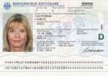

# ID C Through API
Identify and classify IDs and passports on documents.

#### Endpoints
The ID C Through API is available on [RapidAPI](https://rapidapi.com/tssd/api/id-c-through/).

Base-URL (authentication required):  
https://id-c-through.p.rapidapi.com/

#### Supported ID Cards:
| COUNTRY 	| TYPE     	| FRONT 	            | EXAMPLE 	                                                            | BACK                 	| EXAMPLE                                                        	    |
|---------	|----------	|:-----:	            |----------	                                                            |------	                |----------	                                                            |
| Austria	| IDCARD 	| :heavy_check_mark:   	|    	    | :heavy_check_mark:                  	|            |
| Belgian 	| IDCARD 	| :heavy_check_mark:   	|            | :heavy_check_mark:   	|       	    |
| Chile 	| IDCARD 	| :heavy_check_mark:   	|    	        | :heavy_check_mark:                  	|                |
| Czech 	| IDCARD 	| :heavy_check_mark:   	|    	        | :heavy_check_mark:                  	|         	    |
| Czech 	| PASSPORT 	| :heavy_check_mark:   	|          | :no_entry:                  	|                                                               	    |
| Dutch 	| IDCARD 	| :heavy_check_mark:   	|            | :heavy_check_mark:   	|       	    |
| France 	| IDCARD 	| :heavy_check_mark:   	|            | :heavy_check_mark:   	|       	    |
| Germany 	| IDCARD 	| :heavy_check_mark:   	|            | :heavy_check_mark:   	|       	    |
| Germany 	| IDCARD (old) 	| :heavy_check_mark:   	|    | :heavy_check_mark:   	|      |
| Germany 	| IDCARD (temporal) 	| :heavy_check_mark:   	|    | :heavy_check_mark:   	|      |
| Germany 	| PASSPORT 	| :heavy_check_mark:   	|        | :heavy_check_mark:               	|                                                                       |
| Germany 	| RESIDENCE_PERMIT 	| :heavy_check_mark:   	|            | :heavy_check_mark:   	|       	    |
| Italy 	| IDCARD 	| :heavy_check_mark:   	|            | :heavy_check_mark:   	|       	    |
| Luxembourg| IDCARD 	| :heavy_check_mark:   	|            | :heavy_check_mark:   	|       	    |

See [REST API Documentation](docs/REST_API.md) for sample request.

**Current Version:** [v3_20211103](docs/RELEASE_NOTES.md)

#### [Roadmap](docs/ROADMAP.md)

### Feature Request or request for new id cards
For additional features or support for more ID cards / passports etc. [please create an issue](https://github.com/tobiassteidle/Identity-Card-And-Passport-Classification-API/issues/new).

